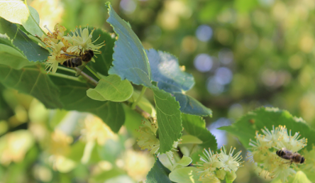
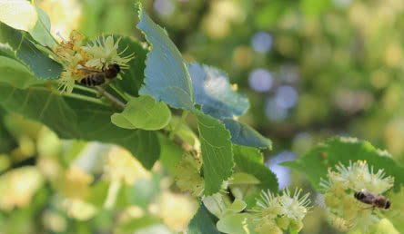
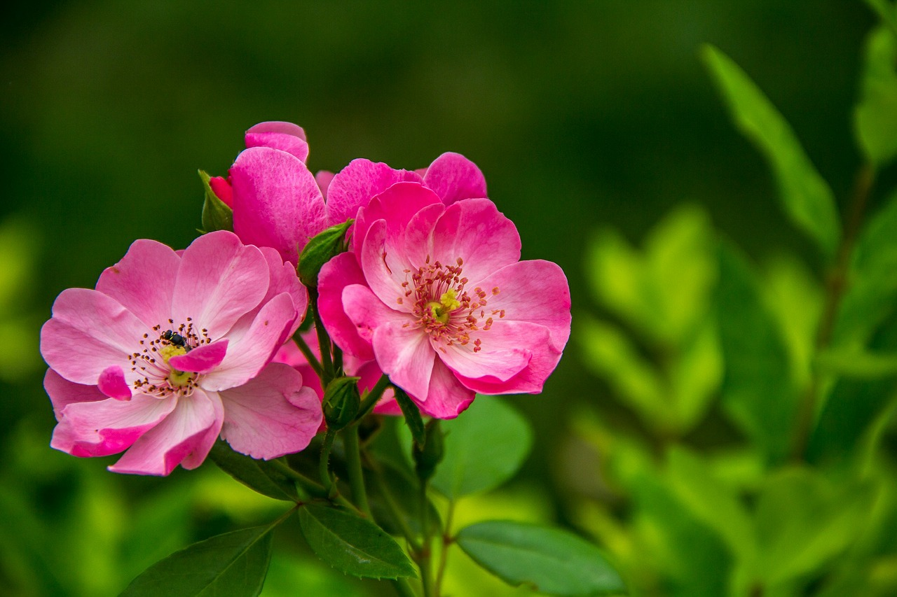

# Docker Google's Guetzli
Run Google's Guetzli within Docker.

Visit https://github.com/google/guetzli for Guetzli's full documentation

## Usage
```sh
docker run --rm -v $(pwd):/data ghcr.io/jveldboom/docker-google-guetzli:latest \
  input.jpg output.jpg
```

## Run Examples
```sh
docker run --rm -v $(pwd):/data ghcr.io/jveldboom/docker-google-guetzli:latest \
  --quality 85 ./samples/bees.png ./samples/bees-out.jpg
```

Original | Processed with 85%
:------------: | :-------------:
<br>177 KB | <br> 22 KB
<br>219 KB  | <br> 103 KB

## Performance
Guetzli is intentionally slow — it tries many encodings to find the best compression. Expect processing to take **1 minute or more per megapixel**. It is best suited for batch or offline processing, not real-time use.

It also requires a minimum of **300 MB of memory per megapixel** of input image.

## Contributing

### Build the image locally
```sh
# build the image locally
docker build -t docker-google-guetzli .

# run locally built image
docker run --rm -v $(pwd):/data docker-google-guetzli \
  --quality 85 ./samples/bees.png ./samples/bees-out.png

# check size
docker image ls docker-google-guetzli
```
